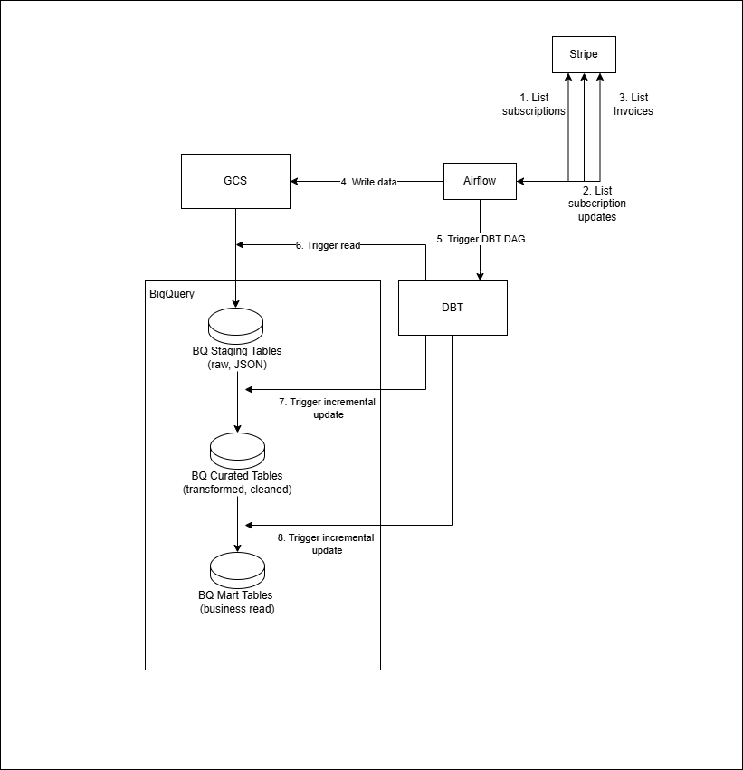
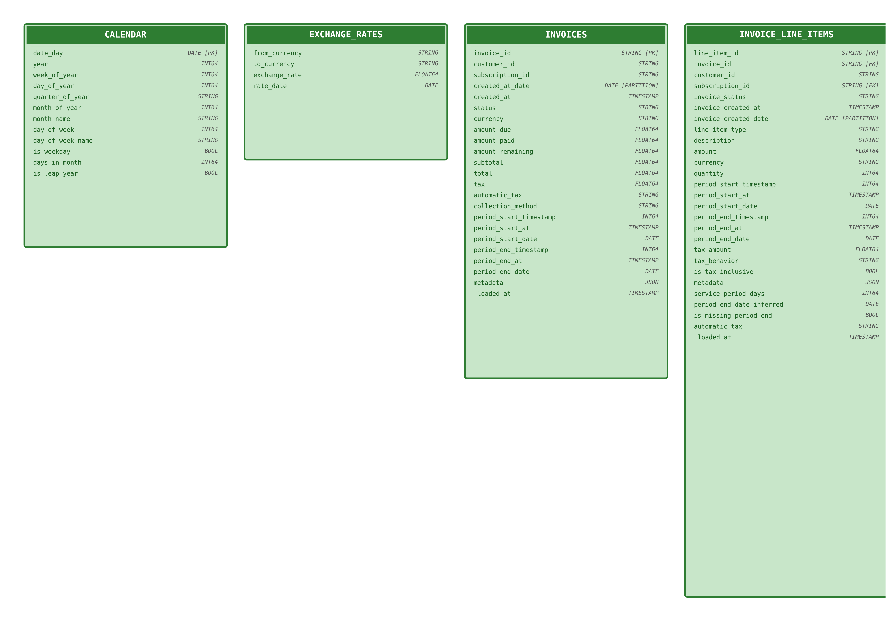
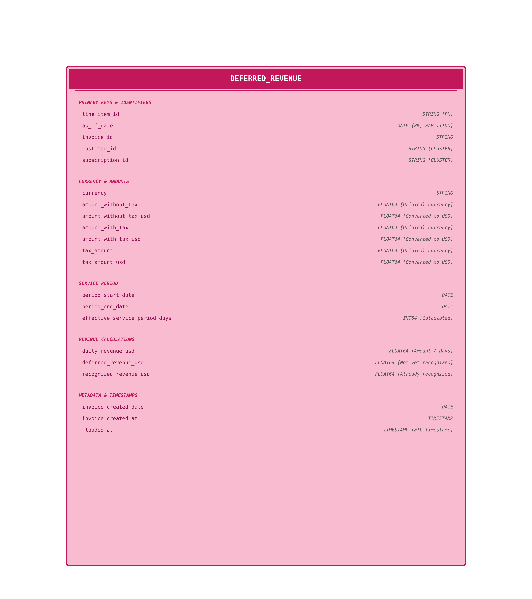

# Stripe Revenue Recognition Pipeline

This is a demo pipeline for Stripe revenue recognition. It is built on top of the following tools:

- Stripe API
- Google Cloud Storage
- Google BigQuery
- Airflow
- DBT


Please note that this is **not** a complete solution but rather a demo of what the pipeline could look like.
It is kept as simple as possible to focus on the core requirements in the technical document.

## Architecture

### Data Flow



**GCS → Staging → Curated → Marts**

1. **GCS**: Raw Stripe data stored in Google Cloud Storage (replaced on each DAG run)
2. **Staging**: Pulls latest data from GCS builds historical data
3. **Curated**: Incremental processing with business logic
4. **Marts**: Final fact tables for analytics and reporting

Each DAG run will extract the data from Stripe and load it to GCS. The write mode is overwrite on GCS so DBT can read the latest data into the staging layer. 
The staging layer will keep the historical data.

Another approach to this is partition the data in GCS and read the latest partition in the staging layer. 
The benefit of this approach is we can archive historical data in GCS to reduce cost. 
However, this requires more complex logic to read the latest partition in the staging layer.

### Models and Schema Design

#### Staging Layer
Raw JSON data from GCS external tables, stored as-is with minimal transformation.

- **`stg_invoices`** - Latest invoices from GCS (JSON as-is)
- **`stg_subscriptions`** - Latest subscriptions from GCS (JSON as-is)
- **`stg_subscription_updates`** - Latest subscription updates from GCS (JSON as-is)

#### Curated Layer
This layer contains the curated models that are used to build the final fact tables.

The invoice line items are **normalized** (flattened from nested JSON arrays into separate rows) for the following reasons:


- **Granular Revenue Recognition**: Revenue recognition happens at the **line item level**, not the invoice level.
Each line item has its own service period (`period.start` and `period.end`), amount, and tax treatment
A single invoice can contain multiple line items with different service periods.
It makes sense to normalized the line items to allow each item to be independently processed through the revenue recognition logic.

- **Simplified Query Logic**: Downstream models (marts layer) can directly join on `line_item_id` without complex JSON parsing or UNNEST operations.
Enables efficient filtering, aggregation, and analysis at the line item level.
Improves query **performance** by avoiding repeated JSON extraction in every downstream query.

- **Clearer Data Lineage**: The transformation from nested JSON to normalized rows happens once in the curated layer.
All downstream models work with clean, typed columns instead of JSON extraction.
Makes the data models easier to track and maintain.

The normalization is performed in `invoice_line_items.sql`.



#### Marts Layer
This layer contains the final fact tables for analytics and reporting.



## Revenue Recognition Logic

To recognize revenue, we need to understand the service period of each line item. 
This allows us to calculate the daily revenue recognition schedule. 

The following digram illustrates the logic for revenue recognition.

For a service item **SI** with amount **M** spanning a service period of **S** to **E**, with (**E** - **S**) representing the total number of days:
- **Service Start (S)** to **Service End (E)** defines the total service period
- **Before Service Start**: Deferred Revenue = M, Recognized Revenue = 0
- **During Service Period**:
  - Recognized Revenue = X * M / (E - S), where X is number of days recognized
  - Deferred Revenue = Y * M / (E - S), where Y is remaining days of service
- **After Service End**: Deferred Revenue = 0, Recognized Revenue = M

Revenue is recognized daily over the service period, with deferred revenue decreasing proportionally as time progresses.


## Idempotency and Data Quality

### Idempotency Strategy

The pipeline is designed to be idempotent at multiple levels, ensuring that re-running the same data produces consistent results without duplicates or data corruption.

#### 1. Extraction Layer (Airflow)
- **Incremental Extraction**: Each Stripe endpoint tracks the last extracted timestamp using BigQuery queries
  - Query: `SELECT MAX(CAST(created AS INT64)) FROM {table}`
  - Only fetches records created after the last successful extraction
  - On first run or table not found, defaults to timestamp 0 (fetches all historical data)
- **Overwrite Strategy**: Raw data in GCS is overwritten on each DAG run
  - Ensures GCS always contains the latest snapshot (of the last run)
  - Prevents accumulation of duplicate files
  - Staging layer in BQ maintains historical records, not GCS
- **Rate Limit Handling**: Exponential backoff with retry logic prevents partial loads
  - Up to 50 (random number in this case) retries with exponential delay (2^retry_count seconds)
  - Ensures all data, or none => failure

#### 2. Staging Layer (DBT)
 - Loads the data as is from the external table (the batch of the last run)
 - Incremental load with `merge` strategy to handle reprocessing of the same data based on the resource id

#### 3. Curated Layer (DBT)
- **Incremental Materialization**: All curated models use `incremental` strategy with `merge`
  - `unique_key`: Primary key for each model (e.g., `invoice_id`, `subscription_id`)
  - Incremental load with `merge` strategy to handle reprocessing of the same data based on the resource id
  - Only processes new data based on the max created timestamp
  ```sql
   SELECT * FROM {{ ref('stg_invoices') }}
    
    WHERE created_at_date > (SELECT MAX(created_at_date) FROM {{ this }})
    
  ```


#### 4. Marts Layer (DBT)
- Composite Unique Keys for deferred revenue which uses `line_item_id` + `as_of_date` combinations to prevents duplicate revenue recognition for the same line item on the same date
- Incremental load with `merge` strategy to handle reprocessing of the same data based on the composite key

### Data Quality Controls

#### 1. Schema Validation
- **DBT Tests**: Automated tests on critical fields
  - `not_null` tests on primary keys and revenue amounts
  - `unique` tests on primary keys
  - More can be added ..


- **Type Casting**: Explicit type conversions prevent data type errors
  - Stripe timestamps converted to BigQuery TIMESTAMP and DATE types
  - Amounts divided by 100 and cast to FLOAT64 as Stripe stores cents as integers

#### 2. Business Logic Validation
- **Service Period Validation**: Handles missing or invalid period dates
  - Checks for null `period_end_date` and infers from subscription or defaults to 1-day period
  - Prevents division by zero in daily revenue calculations
  - See `invoice_line_items.sql` lines 102-113 for fallback logic


- **Tax Calculation Validation**: Handles multiple tax scenarios
  - Distinguishes between tax-inclusive and tax-exclusive amounts
  - Handles null tax fields, and defaults to tax-exclusive (0 tax) if no tax data is available

#### 3. Data Freshness Monitoring
- **Timestamp Tracking**: All models include `_loaded_at` timestamp to enables monitoring of when data was last refreshed.
- **Incremental Load Tracking**: Staging models track `created_at` from Stripe. This can be compared against Stripe API to detect missing data.
#### 4. Custom Data Quality Tests

Custom test in `dbt/stripe/tests/missing_period_end_threshold.sql`
  - Alerts if more than 3% of paid invoice line items have missing period_end dates
  - Prevents silent data quality degradation

Possible enhancements:
  - Test for negative revenue amounts (e.g., negative line items for discounts, refunds..etc)
  - Test for orphaned line items (invoice not in staging)
  - Test for missing currency exchange rates
  - Test for calendar date gaps

#### 5. Monitoring and Alerting
 `on_failure_callback` in Airflow DAGS sends alerts when a pipeline fails.


## Example Queries

### Total Deferred Revenue as of Today
```sql
SELECT
    SUM(deferred_revenue_usd) AS total_deferred_revenue_usd
FROM deferred_revenue
WHERE as_of_date = CURRENT_DATE()
```

### Deferred Revenue by Customer
```sql
SELECT
    customer_id,
    SUM(deferred_revenue_usd) AS total_deferred_revenue_usd
FROM deferred_revenue
WHERE as_of_date = CURRENT_DATE()
GROUP BY customer_id
ORDER BY total_deferred_revenue_usd DESC
```

### Deferred Revenue Trend Over Time
```sql
SELECT
    as_of_date,
    SUM(deferred_revenue_usd) AS total_deferred_revenue_usd
FROM deferred_revenue
GROUP BY as_of_date
ORDER BY as_of_date
```

### Recognized Revenue for Q2 2025
```sql
SELECT
    SUM(f.recognized_revenue_usd) AS total_recognized_revenue_usd
FROM fct_recognized_revenue_daily f
JOIN calendar c ON f.recognition_date = c.date_day
WHERE c.year = 2025
  AND c.quarter_of_year = '2'
```
